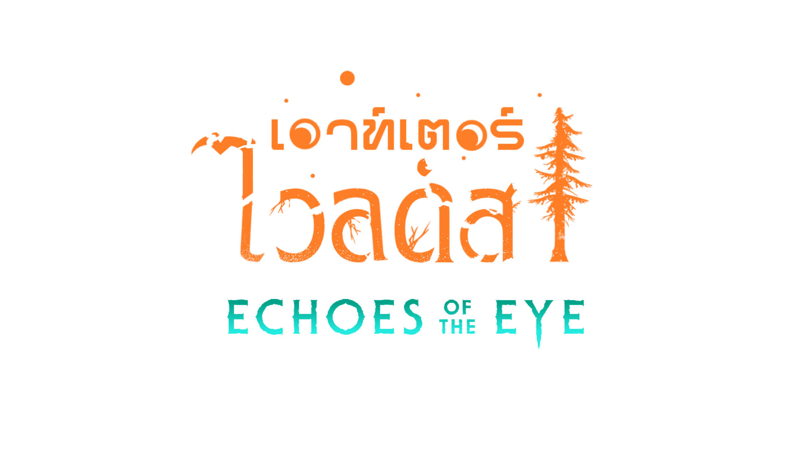
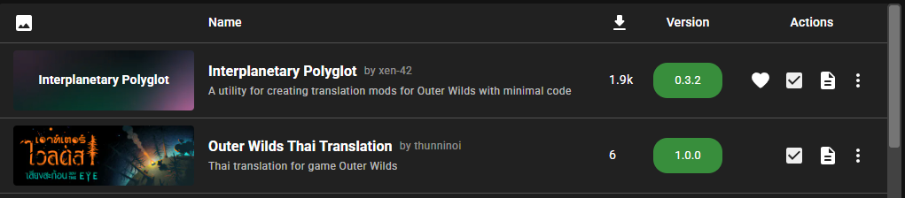

 > For english see below!

ม็อดแปลภาษาไทยสำหรับเกมส์ Outer Wilds  
แปลเกมหลัก + DLC Echoes Of The Eyes  

## อ่านก่อนติดตั้งม็อด 

ม็อดนี้ถูกเขียนให้ปรับขนาดตัวอักษรและเว้นบรรทัดเพื่อให้ใช้กับภาษาไทยได้  
**แนะนำให้ใช้ภาษาไทยเท่านั้นหากติดตั้งม็อดไว้**  

## วิธีติดตั้งม็อด

- โหลด [Outer Wilds Mod Manager](https://outerwildsmods.com/mod-manager/)
- ติดตั้งม็อดตัวนี้ผ่านในโปรแกรม
- เปิดใช้งานม็อดนี้และ Interplanetary Polyglot  
ด้านใน Mod Manager ควรจะมีหน้าตาแบบนี้  

## ฟอนต์ที่ใช้
 - บทพูดและ UI - [KMITLGO](https://thaifaces.com/specimen/kmitl-go)        
 - เครื่องแปลภาษา - [Chakra Petch](https://thaifaces.com/specimen/th-chakra-petch)
 - จอในยาน - [SILPAKORN70NEW](https://thaifaces.com/specimen/silpakorn70new)
 - โหมดเบาะแส - [RSU](https://thaifaces.com/specimen/rsu)
 
 #
   
# Eng Ver. 
Thai Translation for Outer Wilds  
Translate full game + DLC Echoes Of The Eyes

## Read before install

Mod is coded to adjust character size and spacing to be compatible with Thai's character  
**Recommend to use Thai language only if this mod is installed**  

## Installation

- Install [Outer Wilds Mod Manager](https://outerwildsmods.com/mod-manager/)
- Install this mod through mod manager
- Set this mod and Interplanetary Polyglot as activated  
Your mod manager should look like this

## Font used
 - Dialogue & UI - [KMITLGO](https://thaifaces.com/specimen/kmitl-go)        
 - Translator - [Chakra Petch](https://thaifaces.com/specimen/th-chakra-petch)
 - Ship display - [SILPAKORN70NEW](https://thaifaces.com/specimen/silpakorn70new)
 - Clue mode - [RSU](https://thaifaces.com/specimen/rsu)

