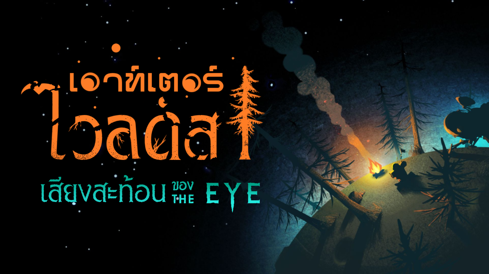

 > For english see below!

ม็อดแปลภาษาไทยสำหรับเกมส์ Outer Wilds  
แปลเกมหลัก + DLC Echoes Of The Eyes  

## อ่านก่อนติดตั้งม็อด 

ม็อดนี้ถูกเขียนให้ปรับขนาดตัวอักษรและเว้นบรรทัดเพื่อให้ใช้กับภาษาไทยได้  
**แนะนำให้ใช้ภาษาไทยเท่านั้นหากติดตั้งม็อดไว้**  

## วิธีติดตั้งม็อด

- โหลด [Outer Wilds Mod Manager](https://outerwildsmods.com/mod-manager/)
- ติดตั้งม็อดตัวนี้ผ่านในโปรแกรม
- เปิดใช้งานม็อดนี้และ Interplanetary Polyglot  
ด้านใน Mod Manager ควรจะมีหน้าตาแบบนี้  

## เจอบัค / แปลผิด / สะกดผิด
เปิด [Issue](https://github.com/thunni-noi/OuterWilds-ThaiTranslation/issues) / [Pull Request](https://github.com/thunni-noi/OuterWilds-ThaiTranslation/pulls) บน Github (ไฟล์ภาษาจะอยู่ที่ [assets/translation.xml](https://github.com/thunni-noi/OuterWilds-ThaiTranslation/blob/main/ThaiTranslation/assets/Translation.xml) แต่บางอันจะเขียนทับลงไปใน[โค้ด](https://github.com/thunni-noi/OuterWilds-ThaiTranslation/blob/main/ThaiTranslation/Patches/FontPatches.cs)เลย)  
หรือติดต่อผมผ่าน Discord (thunninoi) หรือ Twitter (@thunninoi)  
ถ้าผมแก้ได้จะแก้ให้นะครับ :D

## ปัญหาที่พบแล้ว
 - ข้อความบางทีจะตัดไปบรรทัดใหม่ก่อนจบคำ (อันนี้ผมแก้ไม่เป็น, Unity มันไม่ค่อยใจดีกับภาษไทยอยู่แล้วด้วย พอจะม็อดอีกมันเลยเละไปหมด)
  - Easter Egg ลับๆเกี่ยวกับม้วนข้อความอันนึงจะแสดงผลไม่ถูกต้อง (อาจแก้ได้จากการใช้ฟอนต์ใหม่ที่แสดงรูป ASCII)

## ฟอนต์ที่ใช้
 - บทพูดและ UI - [KMITLGO](https://thaifaces.com/specimen/kmitl-go)        
 - เครื่องแปลภาษา - [Chakra Petch](https://thaifaces.com/specimen/th-chakra-petch)
 - จอในยาน - [SILPAKORN70NEW](https://thaifaces.com/specimen/silpakorn70new)
 - โหมดเบาะแส - [RSU](https://thaifaces.com/specimen/rsu)
 - โลโก้ - [SOV_LaiKhnad](https://thaifaces.com/specimen/sov-laikhnad), [DM Twilight Reborn](https://thaifaces.com/specimen/dm-jomkwan)
 

 #
   
# Eng Ver. 
Thai Translation for Outer Wilds  
Translate full game + DLC Echoes Of The Eyes

## Read before install

Mod is coded to adjust character size and spacing to be compatible with Thai's character  
**Recommend to use Thai language only if this mod is installed**  

## Installation

- Install [Outer Wilds Mod Manager](https://outerwildsmods.com/mod-manager/)
- Install this mod through mod manager
- Set this mod and Interplanetary Polyglot as activated  
Your mod manager should look like this

## Found bug / mistranslation
Please open [Issue](https://github.com/thunni-noi/OuterWilds-ThaiTranslation/issues) / [Pull Request](https://github.com/thunni-noi/OuterWilds-ThaiTranslation/pulls) on Github (Translation file is [assets/translation.xml](https://github.com/thunni-noi/OuterWilds-ThaiTranslation/blob/main/ThaiTranslation/assets/Translation.xml) but some are hard-coded in [patches](https://github.com/thunni-noi/OuterWilds-ThaiTranslation/blob/main/ThaiTranslation/Patches/FontPatches.cs))  
Or contact me via Discord (thunninoi) or Twitter (@thunninoi)  
I'll fix it asap if i can! :D

## Known Issues
 - Sometimes the message will cut to new line before finish the word( I don't know how to fix this one, Unity already usually has saome problem with Thai language already and this is also a mod so it messed up a lot)
  - Certain easter egg involving mysterious scroll will display incorrectly (Maybe fixable by using font that support ASCII art)

## Font used
 - Dialogue & UI - [KMITLGO](https://thaifaces.com/specimen/kmitl-go)        
 - Translator - [Chakra Petch](https://thaifaces.com/specimen/th-chakra-petch)
 - Ship display - [SILPAKORN70NEW](https://thaifaces.com/specimen/silpakorn70new)
 - Clue mode - [RSU](https://thaifaces.com/specimen/rsu)
 - Outer Wilds Logo - [SOV_LaiKhnad](https://thaifaces.com/specimen/sov-laikhnad), [DM Twilight Reborn](https://thaifaces.com/specimen/dm-jomkwan)

